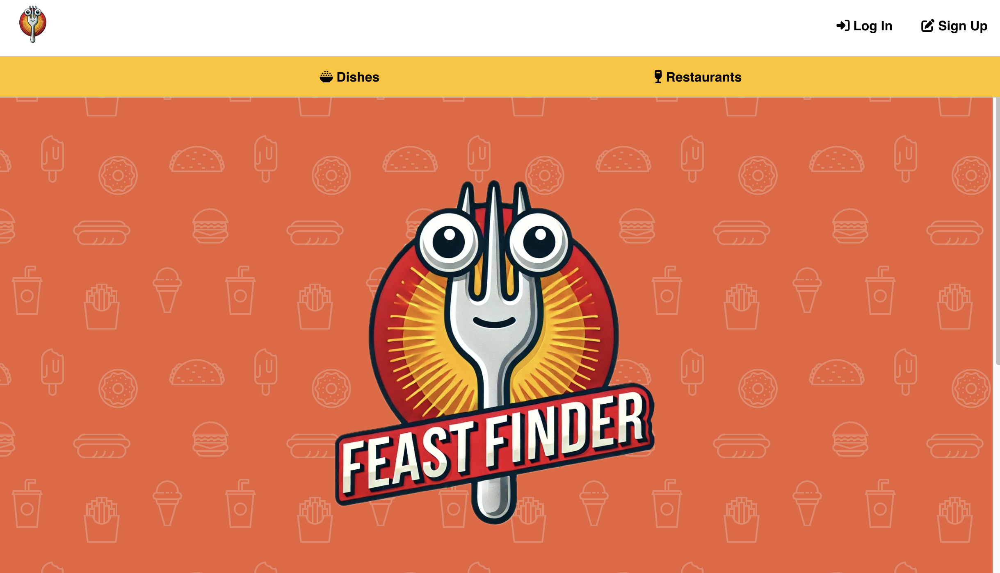

# Home Page and Forker

# FEAST FINDER
Feast Finder is your go-to app for discovering and sharing the best dishes in town. Whether you’re new to the area or a seasoned local, Feast Finder can guide you to top-rated meals and hidden gems near you. Rate individual dishes with our Fork Rating system, and watch as your favorite restaurants earn scores based on your top picks. Connect with fellow food lovers, find trending dishes, and build your personalized list of must-try spots. Feast Finder is your ultimate guide to enjoying the best flavors your city has to offer!

# Webpage 
* [Start You Feast Finder](https://feastfinder.netlify.app/)
* [Trello](https://trello.com/b/9LWlJaLO/feast-finder)

# Technologies Used

 

# Attributions
* Logo--[chatgpt](https://chatgpt.com/)
* Images--[pixabay](https://pixabay.com)

# Next Steps
* As a user, I want to have access to an API of restaurants and their dishes in my locality
* Add search botton allow users to quickly get their target restaurant or dish
* Add dishes favorites list allow users to track their favorites dishes and restaurants in their profiles
* Add edit botton allow users to update their profiles
* Add photo upload button allow users to attach photoes in their reviews
